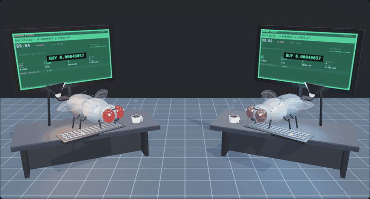
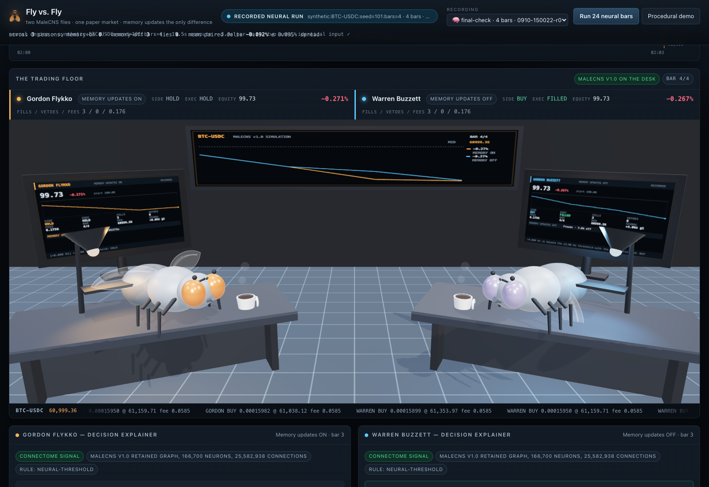
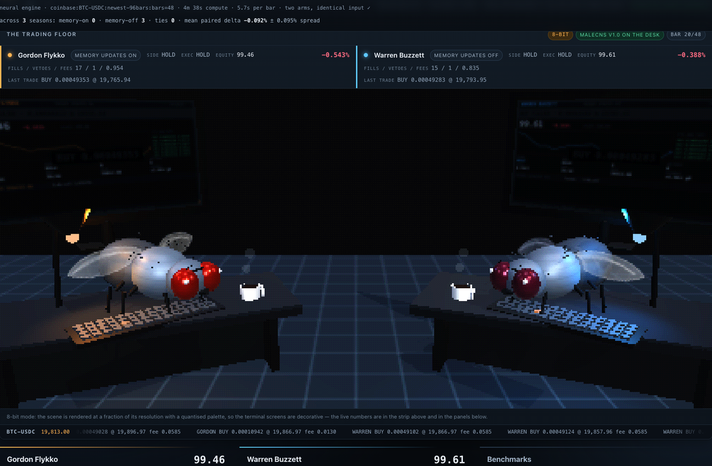

# Fly vs. Fly

### Trading lab visual update

The floor now includes full-fly close-ups, articulated forelegs that reach the keyboard,
warm chitin materials, architectural lighting, and a **Brain scan** toggle. Brain scan
shows six measured signal groups (left/right DNp20, KC, reward DAN, gate, aversive DAN).
The floating clusters, connecting paths, and pulse timing are schematic; they are not
anatomical neuron coordinates or individual spike events. Exact recorded values appear
under the floor. Procedural recordings explicitly show no neural measurements.

[](https://github.com/armanbabazadeh6/fruit-fly-fund/actions/workflows/ci.yml)
[](https://armanbabazadeh6.github.io/fruit-fly-fund/)
[](LICENSE)
[](pyproject.toml)
[](#what-is-and-is-not-claimed)

**[Watch it run](https://armanbabazadeh6.github.io/fruit-fly-fund/)** — the browser
experience replays recorded neural runs with no server and no dataset. The page opens on
the two flies at their terminals, trading.

Two fruit-fly neural simulations, one paper-trading account each, identical market and
identical rules. **Gordon Flykko** applies Stonkfly's experimental memory updates.
**Warren Buzzett** is the same simulation with those updates frozen. The question is
whether the memory rule makes a measurable difference — not whether it helps.

Built on [Stonkfly](https://github.com/nftechie/stonkfly) (MIT, vendored unmodified in
`vendor/`) and the [MaleCNS v1.0](https://male-cns.janelia.org/) male fly connectome:
166,700 neurons, 25,582,938 directed connections, integrated at 0.1 ms by upstream's C++
kernel. A fixed engineered decoder turns DNp20 firing into buy/sell/hold; the fly sees a
320×180 RGB chart, never a price list.

**Paper trading only.** No exchange account, no API key, no real order, no credential
handling anywhere in this project.



*Both flies working a recorded season. The terminals are driven by real telemetry: each desk
reacts to its own fills, and every number on a screen comes from the recording.*

## First result, and how to read it

Three seasons of real public BTC-USDC one-minute candles, 48 bars each, both flies on the
retained graph. **These windows overlap** — the offset used to step between them counted
minutes while a 48-bar season spans about 64 of them, so each season shared roughly 12 bars
with the next. That does not affect any within-season comparison (both flies trade the same
bars), but it does mean these are not three independent markets, and the spread below therefore
understates how much a genuinely different market can move the result. Row-counted offsets and
a `--must-not-overlap` guard are in place now; the runs below predate them.

| | memory ON (Gordon) | memory OFF (Warren) | buy & hold |
| --- | --- | --- | --- |
| mean return over 3 seasons | −1.000% | −0.908% | −0.765% |
| paired difference (on − off) | mean −0.092%, spread ±0.095%, range −0.225% … −0.009% | | |
| seasons won | 0 | 3 | — |
| mean changed KC→MBON efficacies | 3,442 | 0 (frozen) | — |

The memory rule demonstrably did something: it rewrote ~3,400 of the 7,835 eligible
efficacies every season, and the two flies diverged in their decisions. It did not help.
The paired difference is smaller than its own spread across three seasons, both flies lost
to a plain buy-and-hold, and fees plus the inability to short dominate everything else.
That is the honest state of it, and three seasons is far too few to conclude anything
either way: reproduce it with `--repeats 6` and more bars before reading the mean.

### The held-out exam: it does not generalise

The comparison above grades the fly on the same market it learned on. The exam separates them:
learn on one real season, then **freeze both flies** and run a season neither has seen. Nothing
is learned during an exam, so the only difference between the two is the brain each one carried
in. Both are frozen, both face the same 48 unseen minutes, both pay the same fees.

| run | memory-on | memory-off | paired | buy & hold |
| --- | --- | --- | --- | --- |
| training season (learned on it) | −0.900% | −0.935% | **+0.035%** | −0.933% |
| **exam, unseen season** | −0.616% | −0.513% | **−0.104%** | −0.706% |
| **reset control** (learned efficacies wiped) | −0.500% | −0.513% | **+0.012%** | −0.706% |
| exam decided by the fitted readout | −0.068% | −0.194% | +0.127% | −0.706% |

Three things to read out of that:

1. **The advantage did not survive the exam.** Memory-on beat memory-off by +0.035% on the
   season it learned on, then lost by −0.104% on a season it had never seen. That is what
   overfitting to one market path looks like.
2. **The reset control behaves exactly as it must.** Wiping the 3,386 learned efficacies
   returns the fly to the baseline fly (+0.012%, within noise of identical) — so the weights
   really are the only thing the memory rule carries, and they really are worth about nothing
   on this window.
3. **The readout's apparent win is exactly the trap it warns about.** Deciding from a model
   fitted on the fly's own spikes gave memory-on +0.127%; the same model's own holdout accuracy
   is 0.583 against a base rate of 0.583, i.e. **no better than guessing**. A meaningless model
   producing a good-looking number on one paired season is the reason single seasons are not
   evidence.

All four differences are fractions of a percent, on one season, against 42–46 fills each paying
0.6%. One unseen season settles nothing on its own — but it is the shape of the answer, and it
is the opposite of the training result.



Two toggles sit in the floor header: **trade cam** eases the camera to whichever fly just
filled, and **3D / 8-bit** switches the scene between the rendered floor and a pixel-art pass
(289 distinct colours against 36,981, measured): the retro mode looks like the artwork that
inspired the project, with the live numbers kept in crisp text above the canvas because
pixelation makes the on-screen terminals decorative.



## What is and is not claimed

- The neural state, spikes, synaptic efficacies and memory rule statistics are real
  simulation output from the retained connectome.
- The reward/aversive pulses are **engineered** feedback about portfolio value. This is not
  pain, pleasure, consciousness or a fly understanding money.
- The DNp20 decoder is a fixed engineered interface, not a discovered "buy neuron".
- Whether memory updates help is undetermined. Upstream states plainly that profitable
  learning has not been demonstrated, and nothing here changes that.
- Rivalry commentary is entertainment. Procedural demo mode is never neural activity.

### Making them trade

The flies are quiet by default because of upstream's **gate**, not because of the brain: the
DNp20 difference exceeds ±2 Hz on 90–98% of bars, but the DNpe017 gate is open on only
27–60% of them, and a closed gate forces HOLD.

```sh
# Every bar produces an order instead of half of them: HOLD 50% -> 0%, fills 2x
flyvsly run --preset active --bars 48 --repeats 3

# The reinforcement controls: how the reward pulse is scheduled, and what that lets you claim
flyvsly run --preset active --reinforcement decoy     # matched pulses, no contingency
flyvsly run --preset active --reinforcement none      # no pulse at all
flyvsly run --preset active --reinforcement shuffled --shuffle-reference campaign-active-pnl
```

Trading more is not trading better: on the same season the busier preset went from −0.287% to
−0.604%, because every fill pays the fee. Measurements and the full lever list are in
[activity](docs/activity.md).

### The experiment

Three protocols turn a comparison of two anecdotes into something that can be argued with:

```sh
scripts/experiment.sh          # train, fit a readout, exam, reset, readout exam
```

- **Exam** — learn on two real seasons, then freeze both brains and run a season neither has
  seen. Nothing is learned during an exam, so the only variable is the brain each fly carried
  in. This is the difference between homework and an exam.
- **Reset** — the same exam with the trained fly's learned efficacies wiped back to the
  reconstructed baseline, which makes a sharp prediction: a reset brain must be element-wise
  identical to a never-trained one.
- **A readout fitted from the fly** — instead of a threshold a human drew, a small logistic
  model fitted on 256 cells of the fly's own spike counts, with a temporal split, reporting its
  accuracy next to its base rate. A model no better than guessing is reported as exactly that.

`docs/` has the rest: [model](docs/model.md), [fairness](docs/fairness.md),
[telemetry](docs/telemetry.md), [hardware](docs/hardware.md), [activity](docs/activity.md),
[experiments](docs/experiments.md), [the live session](docs/live-session.md).

## Run it

Python 3.11+, a C++17 compiler, macOS or Linux (WSL for Windows).

```sh
python3.12 -m venv .venv && source .venv/bin/activate
pip install -e .
flyvsly prepare              # ~1.1 GB download, 69 s and 1.33 GB peak RSS on an M2 Air
flyvsly doctor --measure     # what this machine can actually run
```

### Windows, without installing a WSL distro

The engine loads `libmemory.so`, so it is Linux-only, and `wsl --install` wants an
administrator and usually a reboot. Docker Desktop's engine is already a Linux VM, so the
same commands run in a container with no elevation and no reboot:

```sh
docker build -t flyvsly-nn -f docker/Dockerfile .
docker run --rm -v "$PWD:/work" -w /work flyvsly-nn \
  bash -lc 'pip install -e . && flyvsly prepare && flyvsly doctor --measure'
```

`data/` and `runs/` are bind-mounted from the host and already git-ignored, so the 1.6 GB
graph and every recording survive between containers.

Run the competition, paper only:

```sh
# Real public Coinbase BTC-USDC candles, 48 one-minute bars, three seasons (see the note
# above: seasons from before the row-counted offset overlap their neighbours).
flyvsly run --engine neural --market coinbase --bars 48 --repeats 3 --label season-coinbase-48

# Offline and reproducible: synthetic seasons on a fixed seed.
flyvsly run --engine neural --bars 24 --seed 5

# Interface-only: the procedural stand-in, labelled everywhere as not neural.
flyvsly run --engine procedural --bars 480 --seed 21

flyvsly list                 # recordings, with each fly's return
flyvsly report               # paired deltas across repeated seasons
flyvsly publish              # copy recordings next to the web bundle for static hosting
```

Every run writes `runs/<id>/`: `recording.json` (everything the browser shows),
`observations.jsonl`, `manifest.json`, and one SQLite ledger per fly.

## Watch it

```sh
cd web && npm install && npm run build && cd ..
flyvsly serve                # http://127.0.0.1:7777
```

`flyvsly serve` serves the built page, lists recordings, streams a running arena over
Server-Sent Events, and can start runs from the UI. The badge in the header always says
which data is on screen: a live neural run, a recorded neural run, or the procedural demo.

The page shows a 3D trading floor — two modeled flies at their desks in front of amber
terminals, under a wall board showing the market and both equity curves — plus a live
scoreboard, equity and price charts with a buy-and-hold and cash benchmark, per-bar spike
and memory telemetry, full trade history, and a per-trade explanation of exactly which
measured signals and which programmed rule produced it.

Every number on a terminal screen or the wall board comes from the recording on screen:
there is no decorative data. The flies are procedural models built from primitives at load time
(`web/src/three/models.ts`): banded abdomen, bristles, halteres, faceted compound eyes,
translucent veined wings, and forelegs rigged to type on individual key caps — the key
under each arm lights as it strikes. No third-party art is downloaded or bundled.
three.js is loaded lazily and never downloaded by a browser without WebGL, which falls back
to the 2D desk illustration instead.

`/floor-check.html` renders the 3D scene by itself, with framing controls and a diagnostic
readout — useful for changing the camera without guessing.

## Cost, measured

On the M2 MacBook Air (8 GB): graph preparation peaks at 1.33 GB RSS; each brain costs
roughly 0.3 GB resident, so two flies fit in about 0.7 GB; one 500 ms neural observation
costs 2–8 s per fly, and the two flies run on separate threads. A 48-bar season therefore
takes roughly 5–10 minutes, dominated by simulation, not by the market or the browser.
See [docs/hardware.md](docs/hardware.md) for the desktop checklist.

## Layout

```
flyvsly/          the arena: two arms, shared market, benchmarks, telemetry, server, CLI
vendor/stonkfly/  upstream Stonkfly at a pinned commit, unmodified (MIT)
web/              Vite + React + TypeScript browser experience
tests/            fairness, execution parity, market seasons, telemetry, gated full-engine test
docs/             model, fairness, telemetry and hardware notes
runs/  data/      local only, git-ignored
```

## Tests

```sh
python -m pytest -q                                  # 124 fast tests
FLYVSLY_NEURAL_TEST=1 python -m pytest -q -m slow    # + the real 166,700-neuron check
```

The gated tests prove the control arm's 7,835 eligible efficacies never move while the
experimental arm's do, that both flies received byte-identical retinal input on every bar,
and that the neural arm's output is unchanged when the arena passes it a different price
history. The fast suite covers fairness, execution parity against upstream's guard, market
seasons, the recorded-ledger reconciliation, the activity controls, and the exam/reset
protocol including the failure modes this project shipped and had to fix.

## Attribution

`UPSTREAM.md` records the pinned Stonkfly commit, what we take from upstream, and what we
add. Upstream's own caveats and validation status are preserved in `vendor/docs/`.
